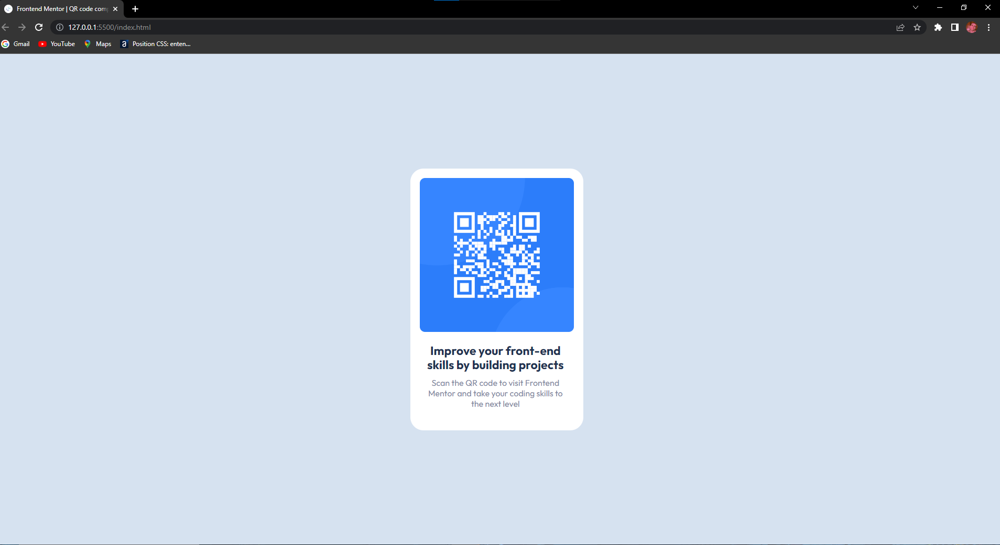

# Frontend Mentor - QR code project

> First Solo Project

I've built this project so as to improve my Frontend skills, once I've been studing this topic for some time. Then, I decided to give it a shot and try building something on my own. Basically, this project consists of a QR code image centralized at the center of the screen with some writings under it. The QR code must be placed inside a DIV with a cellphone shape. 

## Things I learnt:

- How to centralize DIVs 
- How to use Flexbox inside another Flexbox

# Links: 